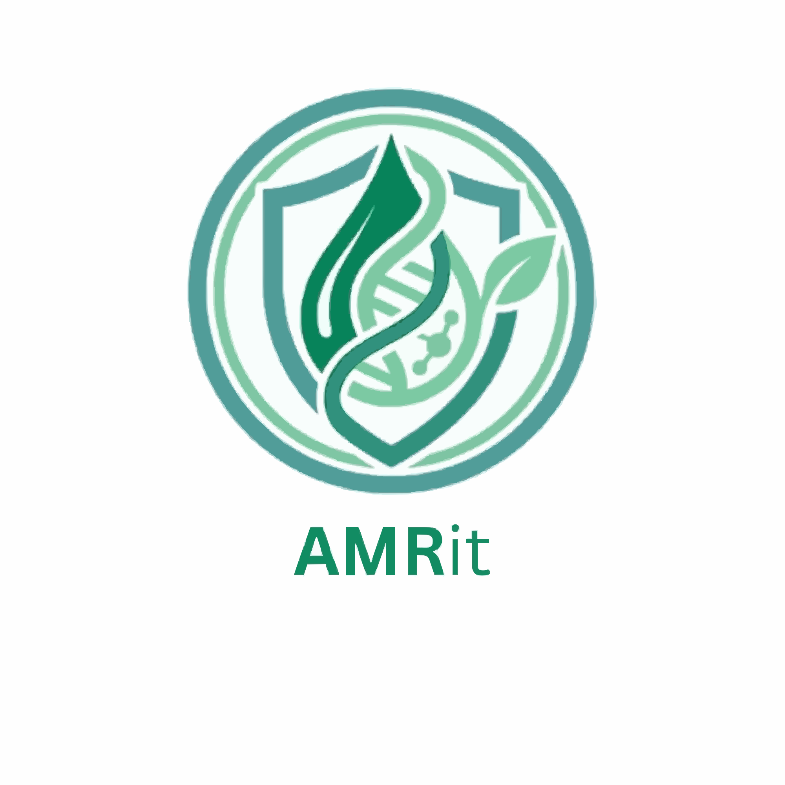

<div align="center">
  
  <h1>AMRit 🛡️</h1>
  <p><strong>Maharashtra's Smart Medical Disposal Network</strong></p>
  <p>Protecting the environment and preventing Antimicrobial Resistance (AMR) through safe, verified, and rewarding medicine disposal.</p>
  
  [](https://chri-amr.vercel.app/login)
  [](#-demo-video)
  [](https://reactjs.org/)
  [](https://ai.google.dev/)
  [](https://nodejs.org/)
  [](https://www.mongodb.com/)
</div>

---

## 🌍 The Problem: The Hidden Crisis of AMR
When citizens throw expired or unused medicines—especially antibiotics—into regular trash or down the drain, these active chemical compounds leak into our soil and waterways. This environmental pollution directly accelerates the global crisis of **Antimicrobial Resistance (AMR)**, a phenomenon where bacteria evolve to survive our strongest medicines, threatening the foundational infrastructure of modern healthcare. 

In Maharashtra alone, a lack of accessible public medical-waste infrastructure means critical antibiotics end up in landfills every single day.

## 💡 Our Solution: AMRit
**AMRit** tackles this exact crisis by bridging the gap between everyday citizens and verified pharmacies. We have built a comprehensive, closed-loop tracking platform that makes safely disposing of medical waste as easy as ordering food online, while intelligently gamifying the process to reward users for protecting public health. 

---

## ✨ Comprehensive Feature Deep-Dive

### 1. The Citizen Experience (User Portal)
* **📍 Interactive Verified Pharmacy Map:** We built a custom interactive map utilizing deterministic coordinate algorithms to securely plot officially registered partner pharmacies strictly within the user's localized city boundaries. 
* **📅 Smart Disposal Scheduling Engine:** A robust "Build Package" pipeline that seamlessly auto-detects antibiotics, calculates the estimated MRP refund value of the wasted medicines, and allows users to schedule either a **Drop-off** or a free **Pick-up** (which includes a specialized routing form for delivery partners).
* **📜 Certified Disposal Ledger:** A permanent, auditable "Disposal History Ledger" that securely tracks exactly which pharmacist handled the package, displaying full Certified Destruction Manifests for absolute transparency.
* **🌐 Multilingual Accessibility (i18n):** To ensure maximum reach and inclusivity across Maharashtra, the entire platform instantly toggles between English, Hindi, and Marathi via native React-i18next framework architecture.

### 2. AI-Powered "Medicine Assistant" (Gemini Integration)
* **🤖 Conversational Medical AI:** Powered by the **Google Gemini 2.5 API**, we embedded a seamlessly floating chatbot directly into the dashboard. 
* **Custom Biological Knowledge Base:** The AI is strictly prompt-engineered utilizing a custom contextual knowledge base. It is locked into discussing biology, AMR risks, and explicitly guiding users step-by-step through our platform's Drop-off/Pick-up booking UI. It automatically steers unrelated "hallucinated" conversations back to safe medical waste disposal.

### 3. Gamified Rewards & Points Architecture
To drive mass adoption, we built a highly algorithmic points and discount system designed to incentivize behavior over time:
* **Point Accrual Tracking:** Users only earn points *after* the Dual-Entity Verification System confirms their drop-off.
* **Discount Milestones (The Monthly Cycle):** Rewards are structured to drive sustained habit-building rather than one-off drops. 
   - After their **1st verified successful package** in a single month, they unlock a **20% flat discount** code for their next affiliated pharmacy purchase.
   - Subsequent drops in the same month yield compounding points that elevate their status.
* **Live Global Leaderboards:** We implement a dual-tab architecture ranking the most environmentally conscious *Citizens* against the most active *Partner Pharmacies*. This breeds healthy, gamified regional competition.

### 4. Dual-Entity Verification System (Trust & Transparency)
To ensure the system cannot be gamed and that dangerous biomedical waste is definitively destroyed, we designed a strict cross-verification audit trail:
* **The User Declaration:** Users log onto their portal, build a "Disposal Package", and manually or automatically declare the exact fractional quantity of medicines (e.g., 8 out of 10 tablets) they are turning in, including MRP value estimations.
* **The Pharmacist Blind-Audit:** When the user arrives at the pharmacy (or the delivery agent drops it off), the pharmacist opens their enterprise portal. Rather than just clicking "approve", the pharmacist must actively select and log the medicines they *physically received* in the package.
* **Algorithmic Cross-Verification:** The AMRit backend instantly cross-verifies the User's Declaration against the Pharmacist's Audit. Only when the physical items perfectly match the digital declaration is the package officially marked as `completed`.
* **Antibiotic Neutralization Protocol:** If the package contains antibiotics, the pharmacist is explicitly forced via the UI to initiate and confirm a special neutralization protocol before the Certified Destruction Manifest is issued.

### 5. Enterprise-Grade Security & Authentication
* **🔐 Strict Role-based App Segregation:** Separate React Contexts, API pathways, and routing layouts strictly segregate `user` operations from `pharmacy` operations to prevent authorization leaking. Built on stateless JSON Web Tokens (JWT).
* **Passwordless OTP Email Verification:** Integrated with the **Resend API** to allow highly secure sign-ups, password resets, and login attempts using time-expiring 6-digit OTPs sent directly to the user's inbox. Enforced minimum password lengths and hashed local credentials via **bcrypt**.

---

## 🛠️ Technical Architecture

### Frontend Layer
* **Framework:** React 18 + Vite for lightning-fast Hot Module Replacement and highly optimized production browser bundling.
* **Styling Framework:** Vanilla Tailwind CSS paired with custom structural animations and native conditional Dark Mode standardizations implemented strictly across all layout components.
* **Icons Elements:** Lucide React for consistent, scalable SVG iconography.
* **State & Routing:** React Router v6 for secure Protected Routes and React Context APIs for deeply nested state hooks.

### Backend Layer
* **Core Runtime:** Node.js with Express.js architecture ensuring efficient non-blocking I/O.
* **Database:** MongoDB configured with Mongoose ORM utilizing heavily normalized schemas (`User`, `Disposal`, `Otp`).
* **Microservices:** Nodemailer/Resend integrated for async transactional email delivery.

### External APIs
* **Google Generative Language API:** Gemini 2.5 Flash for conversational inferences.
* **Resend Email API:** High-deliverability transactional emailing infrastructure.
* **Leaflet/OpenStreetMap:** Lightweight geographical mapping without the bloat of heavy map SDKs.

---

## 🚧 Challenges We Overcame
1. **Asymmetric State Verification:** Designing the Dual-Entity Verification System required deep state reconciliation. The backend had to safely process two distinct payloads (the user's initial declaration and the pharmacy's blind audit) and execute an exact matching algorithm to prevent exploitation of the rewards engine.
2. **Map Geolocation Tiers:** Relying on heavy, expensive map APIs wasn't feasible for a scalable hackathon MVP. We built custom deterministic algorithms to translate string-based pharmacy names directly into hyper-local map coordinates localized to the user's mapped city, ensuring UI consistency without premium API keys.
3. **Complex UI State Management:** Managing the "Disposal Package Cart" (which inherently handles fractional quantities, multi-medicine arrays, address forms, and two radically different fulfillment workflows) required deep React state lifting and strict front-to-back validation layers.
4. **Prompt Isolation & Hallucination Defense:** Ensuring the Gemini AI didn't hallucinate or provide off-topic advice. We utilized strict System Prompts preventing markdown injection and enforcing "steer-back" marketing constraints.

---

## 🚀 Getting Started Locally

### Prerequisites
* Node.js (v18+)
* MongoDB Connection String (Atlas or Local)

### 1. Clone the Repository
```bash
git clone https://github.com/emirald2202/CHRI_AMR.git
cd CHRI_AMR
```

### 2. Setup Backend Server
```bash
cd backend
npm install
```
Create a `.env` file in the `backend` directory:
```env
PORT=5000
MONGODB_URI=your_mongodb_connection_string
JWT_SECRET=your_super_secret_jwt_key
RESEND_API_KEY=your_resend_api_key
```
Start the backend server:
```bash
npm start
```

### 3. Setup Frontend Client
Open a new terminal and run:
```bash
cd frontend
npm install
```
Create a `.env` file in the `frontend` directory:
```env
VITE_API_URL=http://localhost:5000/api
VITE_GEMINI_API_KEY=your_google_gemini_api_key
```
Start the Vite development server:
```bash
npm run dev
```

---

## 🎥 Demo Video
[

---

## 📄 License
This project is licensed under the **MIT License**.

---
